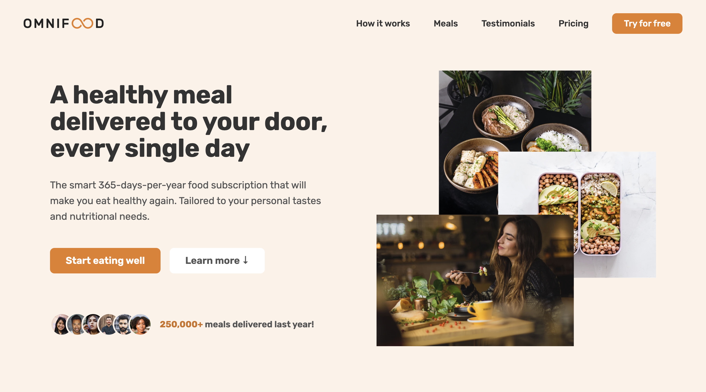

<h1 align="center">🍱 Omnifood 🥗</h1>

`Omnifood` is a tech company focused on promoting well-being through healthy eating. They use AI to create personalized meal plans based on user preferences. Partnering with restaurants, they deliver one or two meals per day, every day of the month in selected cities via a monthly subscription.

  
  

Click [here](https://omnifood-rajeev.netlify.app/) to try out Omnifood.

## Features and Interfaces

- Never cook again!: Our subscriptions cover 365 days per year, even including major holidays.
- Local and organic: Our cooks only use local, fresh, and organic products to prepare your meals.
- No waste: All our partners only use reusable containers to package all your meals.
- Pause anytime: Going on vacation? Just pause your subscription, and we refund unused days.

## Tech stack

#### Frontend

- HTML
- CSS
- JavaScript
- Markdown
- DOM

#### Other Tools

- VS Code
- Prettier
- Netlify
- Git

## Points to remember while testing the WebApp

1. First of all fork this [Repository](https://github.com/beRajeevKumar/Omnifood.git) and clone it.
2. Drag the project into VS Code.
3. Click to the [Live Server](https://marketplace.visualstudio.com/items?itemName=ritwickdey.LiveServer) extension and run the `index.html` file.
4. The app is now running, Now you can test the Website.

## Useful Links

- [Project Demo](https://omnifood-rajeev.netlify.app/) for Web Version.

- [Project Repository](https://github.com/beRajeevKumar/Omnifood.git)

## Need help?

Feel free to contact me on [Twitter](https://twitter.com/be_rajeevkumar) or [LinkedIn](https://www.linkedin.com/in/berajeevkumar/), know more about me at my [Portfolio](https://iamrajeev.me).

<h1 align=center>Happy Coding 👨‍💻</h1>
